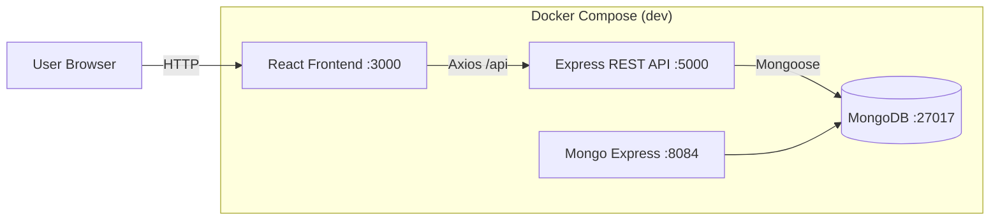

# Employee Management Dashboard (Full‑Stack)

A clean, resume-ready **employee management dashboard** featuring a modern React UI (Router + Axios) backed by an Express REST API and MongoDB.

This repo is intentionally optimized to showcase practical front-end patterns:
- **Debounced search** (no request‑per‑keystroke spam)
- **Sortable + paginated tables**
- Create / edit flows with **inline validation**
- **Toast notifications** for success/error feedback
- **Routing + protected routes** (demo login)

---

## Live demo (local)

- Frontend: `http://localhost:3000`
- Backend API: `http://localhost:5000/api`
- Health check: `http://localhost:5000/api/health`
- Mongo Express (optional): `http://localhost:8084` (user: `admin`, pass: `pass`)

---

## Architecture

### High-level diagram



### Request flow (example: debounced search)

1. User types in the search box (UI state updates instantly).
2. Search input is **debounced ~250ms**.
3. React calls `GET /api/employees/search?q=<term>` via Axios.
4. Express runs a Mongo query using a case-insensitive regex across name/email.
5. Results render in the table; pagination/sorting are applied client-side.

---

## Tech stack

**Frontend**
- React 18 (Create React App)
- React Router
- Axios
- Lightweight custom UI (CSS) + toast component

**Backend**
- Node.js + Express
- MongoDB + Mongoose

**Dev environment**
- Docker Compose (frontend + backend + MongoDB + Mongo Express)

---

## Key features

### Frontend (React)
- Employee directory table with **sorting** (click column headers)
- **Pagination** (page size 8; adjustable in code)
- **Debounced search** with clear empty/loading states
- Create / Edit / Delete employees
- **Form validation**
  - Required fields
  - Email format
  - Salary > 0
- Toast notifications for create/update/delete success and API errors
- Demo login + protected route for `/employees`

### Backend (Express + MongoDB)
- REST API:
  - `GET /api/employees`
  - `GET /api/employees/search?q=...`
  - `GET /api/employees/:id`
  - `POST /api/employees`
  - `PUT /api/employees/:id`
  - `DELETE /api/employees/:id`
- Health check:
  - `GET /api/health`
- Data constraints:
  - `email` is **unique** (Mongo/Mongoose unique index)

---

## Data model

Employee document (MongoDB):

```json
{
  "first_name": "Ada",
  "last_name": "Lovelace",
  "email": "ada@example.com",
  "gender": "Female",
  "salary": 120000
}
```

Schema highlights:
- `first_name`, `last_name`, `email`, `gender`, `salary` are required
- `salary` is stored as a number
- `email` is unique

---

## API contract

### Create employee
`POST /api/employees`

Example request body:
```json
{
  "first_name": "Ada",
  "last_name": "Lovelace",
  "email": "ada@example.com",
  "gender": "Female",
  "salary": 120000
}
```

### Update employee
`PUT /api/employees/:id`

### Search employees
`GET /api/employees/search?q=ada`

---

## Project structure

```text
.
├── backend/
│   ├── src/
│   │   └── index.js              # Express app + routes + Mongoose model (compact, single-file)
│   ├── Dockerfile
│   └── .env.example
├── frontend/
│   ├── src/
│   │   ├── api/
│   │   │   ├── httpClient.js     # Axios instance
│   │   │   └── employees.js      # Employees API wrapper
│   │   ├── components/
│   │   │   ├── NavBar.jsx
│   │   │   ├── RequireAuth.jsx   # Protected route wrapper
│   │   │   └── Toast.jsx
│   │   ├── pages/
│   │   │   ├── Home.jsx
│   │   │   └── Login.js
│   │   ├── EmployeeManager.js    # Dashboard UI (table + form)
│   │   ├── auth.js               # Demo auth utilities (localStorage)
│   │   └── App.js                # Routes
│   ├── Dockerfile
│   └── package.json
└── docker-compose.yml
```

> Note: The backend keeps routes + model in a single file for compactness. In a production codebase, you’d typically split this into `/routes`, `/controllers`, and `/models`.

---

## Run with Docker Compose (recommended)

From the project root:

```bash
docker compose up --build
```

What you get:
- React dev server with hot reload on `:3000`
- Express API on `:5000`
- MongoDB on `:27017`
- Mongo Express UI on `:8084`

---

## Run locally (without Docker)

### Backend
```bash
cd backend
cp .env.example .env
npm install
npm run dev
```

### Frontend
```bash
cd frontend
npm install
npm start
```

If running locally, ensure CRA proxy points to your backend:
- In `frontend/package.json`:
  - `"proxy": "http://localhost:5000"`

---

## Environment variables

Backend (`backend/.env`):
- `PORT` (default: 5000)
- `MONGO_URI` (default in Docker: `mongodb://mongodb:27017/employee_management`)

---

## Troubleshooting

- **Mongo connection errors in Docker:** ensure Docker Desktop is running and ports 27017/5000/3000 aren’t already used.
- **CORS / API errors locally:** use the CRA proxy and avoid hardcoding API URLs.
- **Duplicate email on create:** email is unique by design; try a different email.

---

## Roadmap (optional enhancements)

- Server-side pagination + sorting (for large datasets)
- Real authentication (JWT + refresh tokens)
- Input sanitization + stronger validation on the API
- Unit/integration tests (React Testing Library + Supertest)
- CI pipeline (GitHub Actions) for build + lint + tests


## Tests

### Backend
```bash
cd backend
npm test
```

### Frontend
```bash
cd frontend
npm test
```

> Frontend tests run with CRA's Jest runner. In CI, tests run in non-interactive mode.
